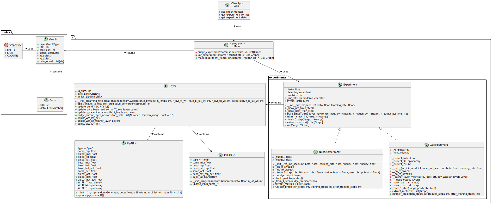

# dendritic-microcircuits
Implements small network for learning in dendritic cortical microcircuits.
Based on the paper "Dendritic cortical microcircuits approximate the backpropagation
algorithm" by Sacramento, Costa, Bengio, and Senn, NeurIPS, 2018.

Not debugged.

## Installation

### On *NIX systems

```bash
# Create virtual environment
python3 -m venv .env
# Activate it
source .env/bin/activate
# Install dependencies
python3 -m pip install -r requirements.txt
```

### On Windows systems

```batch
:: Create virtual environment
python -m venv .env
:: Activate it
.env\Scripts\activate
:: Install dependencies
python -m pip install -r requirements.txt
```

## Running the application

```bash
# *NIX
python3 -m flask run --debug

# Windows 
python -m flask run --debug
```

## Current app architecture


